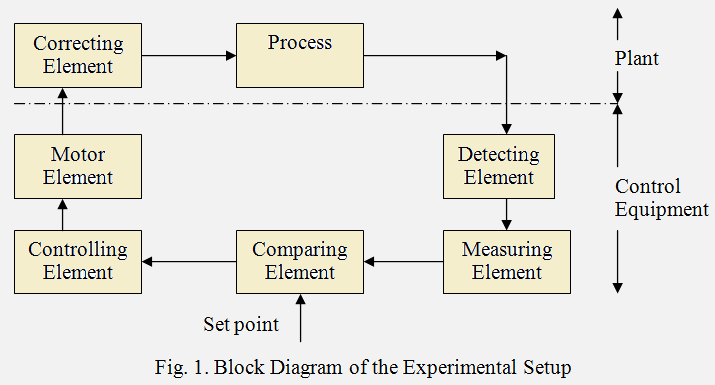

## Introduction

<b>Discipline | <b> Electrical Engineering 
:--|:--|
<b> Lab | <b> **Control and Instrumentation Lab**
<b> Experiment|     <b> **Study and operation of the Process Trainer set up and Experiment 9**

### About the Experiment 
**System description**

Air drawn from atmosphere by a centrifugal blower is driven past a heater grid through a length of tubing to atmosphere again.The process consists of heating the air flowing in the tube to the desired temperature level. The purpose of the control equipment is to measure the air temperature,compare it with a value set by the operator and generate a control signal which determines the amount of electrical power applied to a correcting element,in this case a heater mounted adjacent to the blower. The range of temperature variation is from the ambient level to 60&deg;C. A block diagram of the system is shown in Fig. 1 below.

                  

<b>Name of Developer | <b> **Prof. Alok Kanti Deb**
:--|:--|
<b> Institute | <b>  **Indian Institute of Technology Kharagpur**
<b> Email id|     <b>  **alokkanti@ee.iitkgp.ac.in**
<b> Department |  **Department of Electrical Engineering**
<b>Webpage| <b> http://www.iitkgp.ac.in/department/EE/faculty/ee-alokkanti

### Contributors List

SrNo | Name | VLabs Developer or Integration Engineer | Designation | Department| Institute
:--|:--|:--|:--|:--|:--|
1 | **Piyali Chattopadhyay** | Developer & Integration | Project Scientist | Department of Electrical Engineering | IIT Kharagpur | 
