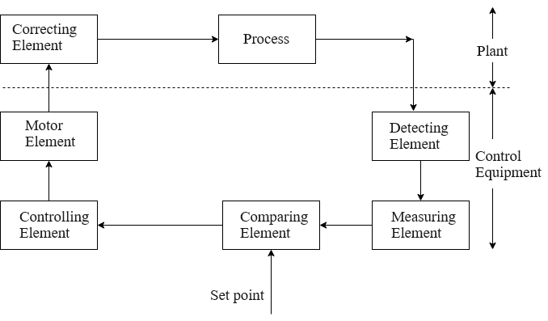

## Introduction

<b>Discipline | <b> Electrical Engineering 
:--|:--|
<b> Lab | <b> **Control and Instrumentation Laboratory**
<b> Experiment|     <b> **Study and operation of the Process Trainer setup**

### About the Experiment 
**System description**

Air is pulled from the atmosphere using a centrifugal blower and directed through a heater grid along a length of tubing before being 
released back into the atmosphere. This process involves heating the air flowing in the tube to achieve the desired temperature. 
The control equipment's role is to gauge the air temperature, compare it against the operator's set value and produce a control signal. 
This signal regulates the amount of electrical power supplied to a correcting element, specifically a heater positioned near the blower. 
The range of temperature variation is from the ambient level to 60&degC. A block diagram of the system is shown in Fig. 1.

 
<b>Fig. 1. Block diagram of the experimental setup</b> 

<b>Subject matter expertise | <b> **Prof. Alok Kanti Deb**
:--|:--|
<b> Institute | <b>  **Indian Institute of Technology Kharagpur**
<b> Email id|     <b>  **alokkanti@ee.iitkgp.ac.in**
<b> Department |  **Department of Electrical Engineering**
<b>Webpage| <b> http://www.iitkgp.ac.in/department/EE/faculty/ee-alokkanti

### Contributors List

SrNo | Name | VLabs Developer or Integration Engineer | Designation | Department| Institute
:--|:--|:--|:--|:--|:--|
1 | **Piyali Chattopadhyay** | Developer | Project Scientist | Department of Electrical Engineering | IIT Kharagpur | 
2 | **Subhasis Mahata** | Integration Engineer | Senior Project Scientist | Department of Mechanical Engineering | IIT Kharagpur |
