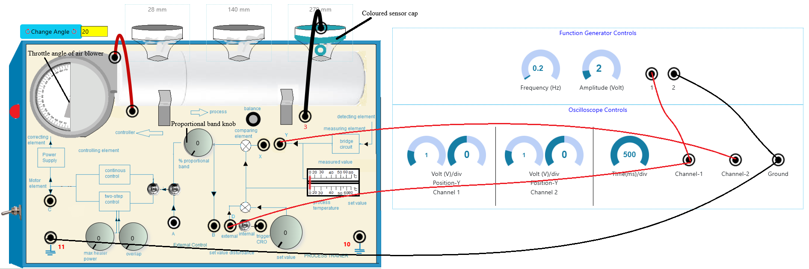
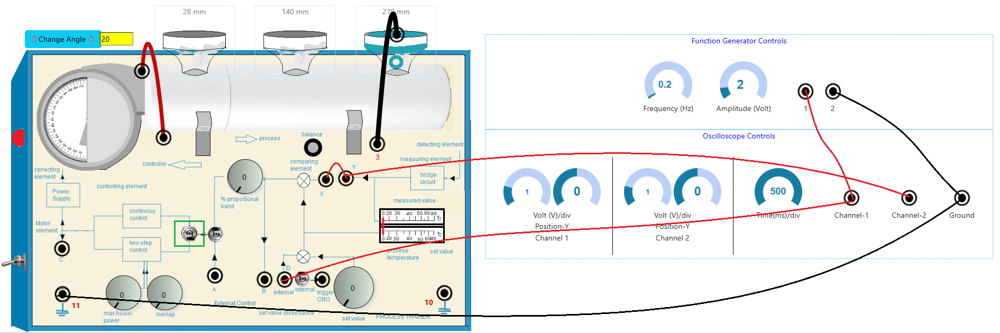

### Procedure

  
<b>Fig. 1. Schematic of the Process Trainer plant with oscilloscope and function generator</b>

 

**Steps to perform the simulation**

<ol>
<b>Open loop-Control</b>

<li><ul><li>First make the wire connection properly through the connecting dots (black dots) in the process trainer kit and in the oscilloscope controls section
(Fig. 2) in simulation section, following the below instructions.</li>
<li><b>Note:</b> Example: connection point 1 - connection point 2 (drag the wire from connection point 1 by pressing left mouse button and release on connection point 2).</li> 
<li>1-Channel-1, D-Channel-1, Ground-2, Ground-11, Y-Channel-2 for open loop control.</li>
<li><b>Note:</b> Any wire connection can be deleted by clicking on the connected wire if required.</li>
</ul></li> 
 

  
<b>Fig. 2. Wire connection in simulation for Open loop-Control</b>

 
<li><ul><li>Click on 'Check Connection' button to check whether the connection is proper or not.</li>
<li>Click on the toggle switch (beside the kit) to switch on the process trainer kit.</li>
<li>The led will glow. Now click on the 'Power' button to switch on the oscilloscope.</li></ul></li> 

<li><ul><li>Click on the clockwise arrow sign of 'Change Angle' button to increase the throttle angle of air blower to 40 &deg;.</li>
<li>Angle value will be shown in the yellow box beside.</li>
<li>Provide a set value temperature of 40&deg;C by rotating the 'set value' knob (rotate knob &approx; to 5.5).</li>
<li>Apply 100 &percnt; proportional band by rotating the 'proportional band' knob.</li>
<li><b>Note:</b> To rotate any knob put the mouse cursor on the knob handle (black line on the knob), a hand symbol will be showing. Press left mouse button, rotate clockwise to increase or anticlockwise to decrease values.</li>
<li><b>Note:</b> If the desired value does not appear while rotating the knob in one attempt, try rotating it back and forth to reach the correct value. If the knob becomes unresponsive at any time, please refresh the page and repeat the experiment.</li>
</ul></li> 

<li> Click on "Square" button (twice) to observe input signal. Apply amplitude to 2 Vp-p, frequency 0.2 Hz. </li> 

<li><ul><li>Now click on 'Output' button to observe the output signal for the particular throttle angle and sensor probe distance from the heater.</li>
<li>Channel-1 will show the input, Channel-2 will show the output and 'Dual' shows both of them.</li>
<li>Click on 'Show Table' button to get the observation data.</li></ul></li> 

<li><ul><li>The experiment can be done for three distances between sensor probe and heater (279 mm farthest distance, 140 mm middle one, 28 mm closest one).</li>
<li>After experiment is done for one distance (i.e. 279 mm), drag the cap from the 140 mm box to the 'keep here the duct caps' box and drop there.</li>
<li>Then drag the sensor cap (colored one) from 279 mm box to 140 mm box and drop there. Connect the black wire with it (drag from it's previous position or point 3 , drop on the cap in 140 mm box).</li>
<li>Then again put the cap from 'keep here the duct caps' box to 279 mm box.</li>
<li>Now follow steps 4-5 for same throttle angle but different distance to observe the output signal as well as observation table.</li></ul>  

<li> Once it is done again follow steps 4-6 for 28 mm distance by moving the sensor cap (colored one) from 140 mm box to 28 mm box.</li> 

<li><ul><li>For one throttle angle there will be three observations (since sensor can be put in three successive distances).</li>
<li>Now click on 'Clear' button and Check output for 60, 80 &deg; angle following steps 3-7.</li>
<li>Bring the blower angle to 40 &deg;, clicking on anticlockwise arrow sign on 'Change Angle' button. Switch off the oscilloscope.</li></ul></li> 

  
</ol>

<ol >
<b>Proportional-Control</b>

<li><ul><li>First make the wire connection properly through the connecting dots (black dots) in the process trainer kit and in the oscilloscope controls section
(Fig. 3) in simulation section, following the below instructions.</li>
<li>1-Channel-1, D-Channel-1, Ground-2, Ground-11, Y-Channel-2 and X-Y for proportional control.</li></ul></li> 
 

  
<b>Fig. 3. Wire connection in simulation for Proportional-Control</b>

 
<li>Click on 'Check Connection' button to check whether the connection is proper or not. Now click on the 'Power' button to switch on the oscilloscope.</li> 

<li><ul><li>Click on the clockwise arrow sign of 'Change Angle' button to increase the throttle angle of air blower to 40 &deg;.</li>
<li>Angle value will be shown in the yellow box beside.</li>
<li>Apply 100 &percnt; proportional band by rotating the 'proportional band' knob.</li></ul></li> 

<li>Click on "Square" button (twice) to observe input signal. Apply amplitude to 2 Vp-p, frequency 0.2 Hz. </li> 

<li><ul><li>Now click on 'Output' button to observe the output signal for the particular throttle angle and sensor probe distance from the heater.</li>
<li>Channel-1 will show the input, Channel-2 will show the output and 'Dual' shows both of them.</li>
<li>Click on 'Show Table' button to get the observation data.</li></ul></li> 

<li><ul><li>The experiment can be done for three distances between sensor probe and heater (279 mm farthest distance, 140 mm middle one, 28 mm closest one).</li>
<li>After experiment is done for one distance (i.e. 279 mm), drag the cap from the 140 mm box to the 'keep here the duct caps' box and drop there.</li>
<li>Then drag the sensor cap (colored one) from 279 mm box to 140 mm box and drop there. Connect the black wire with it (drag from it's previous position or point 3, drop on the cap in 140 mm box).</li>
<li>Then again put the cap from 'keep here the duct caps' box to 279 mm box.</li>
<li>Now follow steps 4-5 for same throttle angle but different distance to observe the output signal as well as observation table.</li></ul></li>  

<li>Once it is done again follow steps 4-6 for 28 mm distance by moving the sensor cap (colored one) from 140 mm box to 28 mm box.</li> 

<li>Vary proportional band to 50, 200 &percnt;  and follow steps 4-7 to observe respective outputs. </li> 

<li><ul><li>For one throttle angle and one proportional band there will be three observations (since sensor can be put in three successive distances).</li>
<li>Now click on 'Clear' button. Angle can be changed to 60, 80 &deg; and observe output for different angles as well as different proportional bands following steps 3-7.</li>
<li>Bring the blower angle to 40 &deg;, clicking on anticlockwise arrow sign on 'Change Angle' button.</li>
<li>Set the proportional band knob to 100 percent by rotating the 'proportional band' knob. Switch off the oscilloscope.</li></ul> </li> 
  
</ol>

<ol>
<b>On-Off Control</b>

<li><ul><li>First make the wire connection properly through the connecting dots (black dots) in the process trainer kit and in the oscilloscope controls section
(Fig. 4) in simulation section, following the below instructions.</li>
<li>1-Channel-1, D-Channel-1, Ground-2, Ground-11, Y-Channel-2, X-Y and click on the toggle switch in the right side of continous control to direct it towards two-step control.</li></ul></li> 
 

  
<b>Fig. 4. Wire connection in simulation for On-Off Control</b>

 
<li>Click on 'Check Connection' button to check whether the connection is proper or not. Now click on the 'Power' button to switch on the oscilloscope.</li> 

<li><ul><li>Provide maximum heater power to 1 by rotating the 'max heater power' knob.</li>
<li>Click on the clockwise arrow sign of 'Change Angle' button to increase the throttle angle of air blower to 40 &deg;.</li>
<li>Angle value will be shown in the yellow box beside.</li>
<li>Apply 100 &percnt; proportional band by rotating the 'proportional band' knob.</li></ul></li> 

<li>Click on "Square" button (twice) to observe input signal. Apply amplitude to 2 Vp-p, frequency 0.2 Hz. </li> 

<li><ul><li>Now click on 'Output' button to observe the output signal for the particular throttle angle and sensor probe distance from heater.</li>
<li>Channel-1 will show the input, Channel-2 will show the output and 'Dual' shows both of them.</li>
<li>Click on 'Show Table' button to get the observation data.</li></ul></li>  

<li><ul><li>Delete the connection of D-Channel-1 by clicking on the connected wire and connect C-Channel-1.</li>
<li>Click on 'Check Connection' button.</li>
<li>Now click on "Square" button to observe output of the controller.</li></ul></li> 

<li><ul><li>Click on 'Clear' button. Now increase the overlap value to 1 by rotating the 'overlap' knob.</li>
<li>Click on 'Square' and 'Output' button to observe controller output and the output signal respectively for the particular throttle angle and sensor probe distance from the heater.</li></ul></li> 

<li>Again follow step 7 with overlap value 2, 3, 4 and observe the controller output. With increase in overlap value the controller output will be more smooth.</li> 

<li><ul><li>The experiment can be done for three distances between sensor probe and heater (279 mm farthest distance, 140 mm middle one, 28 mm closest one).</li>
<li>After experiment is done for one distance (i.e. 279 mm), drag the cap from the 140 mm box to the 'keep here the duct caps' box and drop there.</li>
<li>Then drag the sensor cap (colored one) from 279 mm box to 140 mm box and drop there. Connect the black wire with it (drag from it's previous position or point 3, drop on the cap in 140 mm box).</li>
<li>Then again put the cap from 'keep here the duct caps' box to 279 mm box.</li>
<li>Now check the controller output and the output signal for 140 mm distance between sensor probe and heater following steps 4-8 again.</li> 
<li>Similerly check the controller output and the output signal for 28 mm distance between sensor probe and heater following steps 4-8.</li></ul></li> 

<li>Bring set value to zero by rotating the 'set value' knob. Bring 'max heater power knob' to zero. Switch off the oscilloscope and trainer kit. </li> 

</ol>
