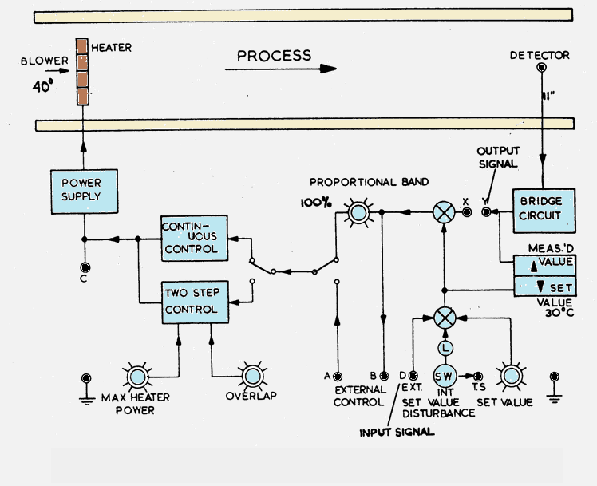

### Procedure
				
**Schematic of the Process Trainer Plant**

            

**Steps to perform the simulation**

<b style="color:blue">Open loop-Control</b>
					
1. At first connect the circuit diagram properly through the connecting dots(black dots)in the Process Trainer kit and in the oscilloscope section,according to below instruction.

1-Channel-1,D-Channel-1,Ground-2,Ground-11,Y-Channel-2 for open loop control.
  
2. Click on 'Check Connection' button to check whether the connection is proper or not.Then click on the toggle switch(beside the kit) to switch on the Process trainer kit.The led will glow.Now click on the 'Power' button to switch on the oscilloscope.
					  
3. Click on the plus sign of 'Change Angle' button to increase the throttle angle of air blower to 40 &deg;.Angle value will be shown in the yellow box beside.Provide a set value temperature of 40&deg; by rotating the 'Set Value' knob and clicking on plus sign on it.Apply 100 percent proportional band by rotating the 'proportional band' knob by clicking on the plus sign on it.
					 
4. Click on "Square" button(twice) to observe input signal. Apply amplitude to 2vp-p,Frequency 0.1Hz. 
					 
5. Now click on 'Output' button to observe the output signal for that particular throttle angle and sensor probe distance from heater.Channel-1 will show the input,Channel-2 will show the output and 'Dual' shows the both.Click on 'Show Table' button to see observation table.
					 
6. The experiment can be done for three distances between sensor probe and heater (279mm farthest distance, 140mm middle one,28mm closest one).After experiment is done for one distance,drag the cap from the 140mm box to the 'keep here the duct caps' box and drop there.Then drag the sensor cap(colored one) from 279mm box to 140mm box and drop there.Connect the black wire with it(drag from 2 ,drop on the cap in 140mm box).Then again put the cap from 'keep here the duct caps' box to 279mm box.Now follow the above steps for same throttle angle but different distance to observe the output signal as well as observation table.Once done again do the same for 28mm distance by moving the sensor cap(colored one) from 140mm box to 28mm box.
					 
7. For one throttle angle there will be three observations(since sensor can be put in three successive distances).Now click on'Clear' button and Check output for 60,80 &deg; angle in same way.Bring the blower angle to 40 &deg;, clicking on minus sign on 'Change Angle' button.Bring setvalue knob to zero position by rotating the 'Set Value' knob and clicking on minus sign on it. Switch off the oscilloscope and trainer kit. 

<b style="color:blue">Proportional-Control</b>
					
1. At first connect the circuit diagram properly through the connecting dots(black dots)in the Process Trainer kit and in the oscilloscope section,according to below instruction.

1-Channel-1,D-Channel-1,Ground-2,Ground-11,Y-Channel-2 and X-Y for Proportional control.
  
2. Click on 'Check Connection' button to check whether the connection is proper or not.Then click on the toggle switch(beside the kit) to switch on the Process trainer kit.The led will glow.Now click on the 'Power' button to switch on the oscilloscope.
					  
3. Click on the plus sign of 'Change Angle' button to increase the throttle angle of air blower to 40 &deg;.Angle value will be shown in the yellow box beside.Provide a set value temperature of 40&deg; by rotating the 'Set Value' knob and clicking on plus sign on it.Apply 100 percent proportional band by rotating the 'proportional band' knob by clicking on the plus sign on it.
					 
4. Click on "Square" button(twice) to observe input signal. Apply amplitude to 2vp-p,Frequency 0.1Hz. 
					 
5. Now click on 'Output' button to observe the output signal for that particular throttle angle and sensor probe distance from heater.Channel-1 will show the input,Channel-2 will show the output and 'Dual' shows the both.Click on 'Show Table' button to see observation table.
					 
6. The experiment can be done for three distances between sensor probe and heater (279mm farthest distance, 140mm middle one,28mm closest one).After experiment is done for one distance,drag the cap from the 140mm box to the 'keep here the duct caps' box and drop there.Then drag the sensor cap(colored one) from 279mm box to 140mm box and drop there.Connect the black wire with it(drag from 2 ,drop on the cap in 140mm box).Then again put the cap from 'keep here the duct caps' box to 279mm box.Now follow the above steps for same throttle angle but different distance to observe the output signal as well as observation table.Once done again do the same for 28mm distance by moving the sensor cap(colored one) from 140mm box to 28mm box.
					 
7. Vary proportional band to 50,200 percent to observe respective outputs. 
					 
8. For one throttle angle and one proportional band there will be three observations(since sensor can be put in three successive distances).Now click on'Clear' button. Angle can be changed to 60,80 &deg; and observe output for different angles as well as different proportional bands in same way.Bring the blower angle to 40 &deg;, clicking on minus sign on 'Change Angle' button.set the proportional band knob to 100 percent by clicking on minus sign on it.Bring setvalue knob to zero position by rotating the 'Set Value' knob and clicking on minus sign on it. Switch off the oscilloscope and trainer kit. 

<b style="color:blue">On-Off-Control</b>
					
1. At first connect the circuit diagram properly through the connecting dots(black dots)in the Process Trainer kit and in the oscilloscope section,according to below instruction.

1-Channel-1,D-Channel-1,Ground-2,Ground-11,Y-Channel-2,X-Y and click on the toggle switch in the right side of continous control to direct it towards Two-step control.
  
2. Click on 'Check Connection' button to check whether the connection is proper or not.Then click on the toggle switch(beside the kit) to switch on the Process trainer kit.The led will glow.Now click on the 'Power' button to switch on the oscilloscope.

3. Provide maximum heater power to 1 by rotating the 'Max heater power' knob, clicking on plus sign on it.Click on the plus sign of 'Change Angle' button to increase the throttle angle of air blower to 40 &deg;.Angle value will be shown in the yellow box beside.Provide a set value temperature of 40&deg; by rotating the 'Set Value' knob and clicking on plus sign on it.Apply 100 percent proportional band by rotating the'proportional band' knob by clicking on the plus sign on it.
					 
4. Click on "Square" button(twice) to observe input signal. Apply amplitude to 2vp-p,Frequency 0.1Hz. 
					 
5. Now click on 'Output' button to observe the output signal for that particular throttle angle and sensor probe distance from heater.Channel-1 will show the input,Channel-2 will show the output and 'Dual' shows the both.Delete the conncetion of D-Channel-1 by clicking on it and connect C-Channel-1 and click on 'Check Connection' button.Now follow the above steps to observe output of the controller.
					 
6. Now click on'Clear' button.Bring setvalue knob to zero position by rotating the 'Set Value' knob and clicking on minus sign on it.Bring 'Max heater power knob' to minimum position. Switch off the oscilloscope and trainer kit. 

		  