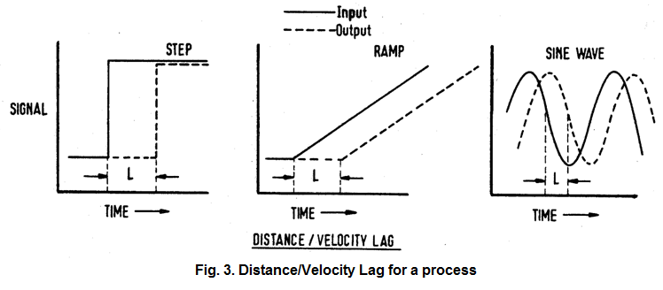
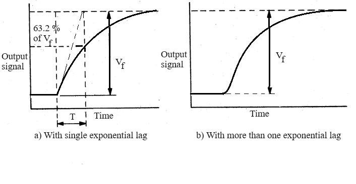
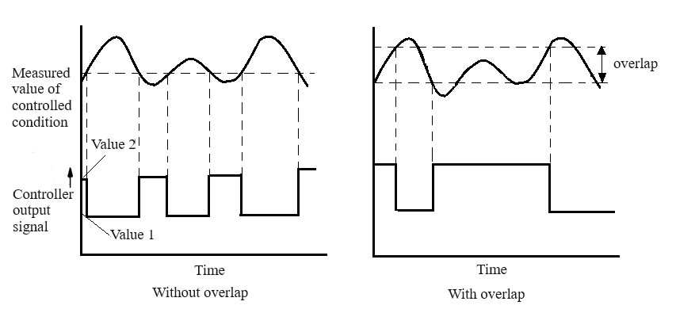

# Theory

<b>The Process</b> 

Air drawn from atmosphere by a centrifugal blower is driven past a heater grid through a length of tubing to atmosphere again.
The procedure involves raising the temperature of the air flowing through the tube to the desired level. The purpose of the control equipment is to 
measure the air temperature, compare it with a value set by the operator and generate a control signal which determines the amount of 
electrical power applied to a correcting element, in this case a heater mounted adjacent to the blower. The range of temperature variation
is from the ambient level to 60&deg;C. The experiment is done at 40&deg;C. A block diagram of the system is shown in Fig. 1 and a brief description of the various blocks and signals
is given below.  

 

<b>Fig. 1. Block diagram of the experimental setup</b>

 

<b>Detecting element</b> 
A bead thermistor fitted to the end of a probe which can be inserted into the air stream at any one of three points along the tube spaced 28 mm, 140 mm and 279 mm from the heater.  

<b>Measuring element</b> 
The thermistor probe forms one arm of a dc bridge, which is in balance at 40&deg;C. The bridge output voltage is amplified to produce 0 to +10 V for an air temperature range of 30&deg;C to 60&deg;C.  

<b>Set point (Reference value, command signal)</b> 
A voltage between 0–10 V is applied to raise the process temperature upto 60&deg;C. A provision to give a step change disturbance is also provided.  

<b>Comparing element</b> 
A summing amplifier.  

<b>Controlling element</b> 
Two types of control are provided :  

i)	Continuous control 
a)	Internal proportional control with

$$k_p = \frac{100}{PB} \tag{1}$$ 

where <i style="font-family:'Bodoni MT'">PB</i> stands for the Proportional Band. 

b)	External : Any external controller such as process control simulator or a digital controller can be connected here.  

ii)	 Two step control (on-off control)  
The maximum heater power can be varied from 15 W to 80 W. 
An overlap can also be provided.  

<b>Motor element </b> 
A variable power supply, which gives an electrical output of between 15 W and 80 W as determined by the controller signal.  

<b>Correcting element </b> 
The electrically heated wire grid activated by the motor element.  

<b>Setting up the equipment </b>  

The connection diagram for the equipment operating in open-loop is shown in Fig. 2. The switches can select between internal and external control as well as between continuous and two-step control. 
If the nodes X and Y are connected, the control loop will be closed. After the connection is properly made the equipment is switched on. The indicator lamp glows and the blower operates.  

For performing the experiments mentioned below a low-frequency function generator capable of generating a square wave of frequency down to at least 0.1 Hz and a storage oscilloscope are required.  

The nominal operating condition for the equipment would be as follows: 

i)	Set Value : 10 degrees above the ambient temperature (Typically varying between 30 deg in winter and 50 deg in the summer) 
ii)	Blower Inlet : 40 degree 
iii) Detector Position : 11” (farthest from the heater) 
iv)	Proportional Band : 100&percnt;  

   
<b>Fig. 2. Connection diagram for the Process Trainer operating in open-loop</b>

 

<b>Experiments </b>   

<b>1. Measurement of distance/velocity lag </b> 
The time lag between a step change in input signal and detection as illustrated in Fig. 3. This delay is also known as dead-time or transport lag. 

 

<b>Fig. 3. Distance/Velocity Lag for a process</b>

 

<b>2. Measurement of transfer lag </b> 
The transfer lag is introduced by the thermal time-constant of the system. The typical open loop responses of systems with
this type of lag are shown in Fig. 4 for a first order and higher order systems. 

 

<b>Fig. 4. Transfer Lag of a process</b>

 

<b>3. Proportional control </b> 
The proportional band (<i style="font-family:'Bodoni MT'">PB</i>) is varied between 200% to 20% and the corresponding values of offset between the set value and the measured value
are recorded. Any special observations like oscillations in the output are also observed.
  

<b>4. Two-step control </b> 

This is an example of on-off control of the system. As shown in Fig. 5, the control logic (without overlap) works as follows  

a.	If the measured value is above the set value the heater is switched off. 
b.	If the measured value is below the set value the heater is switched on. 

This kind of strategy usually gives rise to a chattering in the control signal and a large frequency of oscillation in the output.
To overcome this, an overlap can be introduced, by defining a higher threshold level and a lower threshold level. Then the algorithm works as follows  

a.	If the measured value is above the higher threshold the heater is switched off. 
b.	If the measured value is below the lower threshold the heater is switched on. 

This has the effect of reducing the frequency of oscillation but would increase its amplitude. 

 

<b>Fig. 5. Typical input output waveforms for a process under two-step control action</b>

 				

						
								