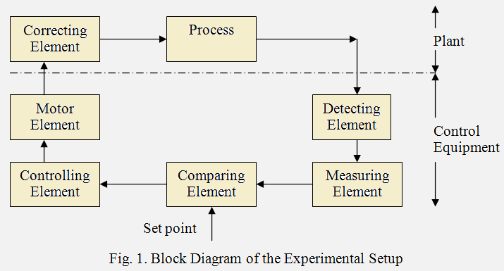
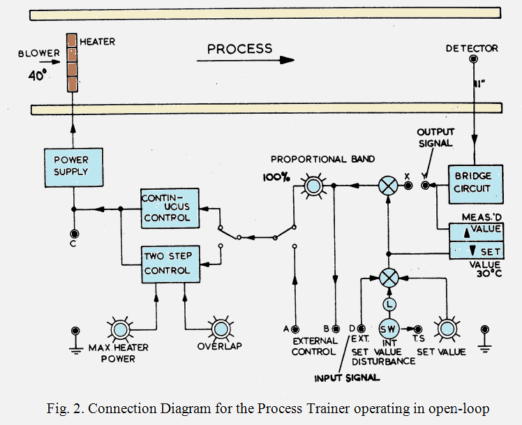
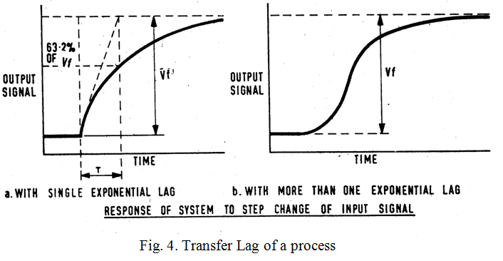
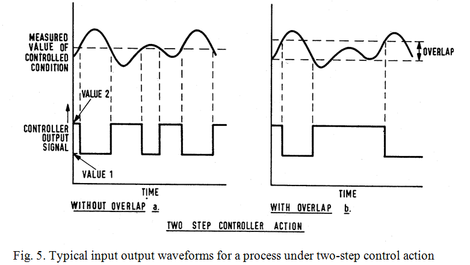

# Theory

 <b style="color:blue">The Process:</b>

Air drawn from atmosphere by a centrifugal blower is driven past a heater grid through a length of tubing to atmosphere again.The process consists of heating the air flowing in the tube to the desired temperature level. The purpose of the control equipment is to measure the air temperature, compare it with a value set by the operator and generate a control signal which determines the amount of electrical power applied to a correcting element, in this case a heater mounted adjacent to the blower. The range of temperature variation
is from the ambient level to 60&deg;C.The experiment is done at 40&deg;C. A block diagram of the system is shown in Fig. 1 and a brief description of the various blocks and signals is given below.
				

<b style="color:blue">Detecting element:</b>

A bead thermistor fitted to the end of a probe which can be inserted into the air stream at any one of three points along the tube spaced 28mm, 140mm and 279mm from the heater.

<b style="color:blue">Measuring Element:</b>

The thermistor probe forms one arm of a D.C. bridge, which is in balance at 40&deg;C. The bridge output voltage amplified to produce 0 to +10V for an air temperature range of 30&deg;C to 60&deg;C.

<b style="color:blue">Set point:</b>

(Reference value, command signal). A voltage between 0 and –10V is applied to raise the process temperature upto 60&deg;C. A provision to give a step change disturbance is also provided.

<b style="color:blue">Comparing Element:</b>

A summing amplifier.

<b style="color:blue">Controlling Element:</b>

Two types of control are provided:

i)	Continuous control:
		
a)	Internal proportional control with

$$K_p = \frac{100}{PB}$$ 
								   
where PB stands for the Proportional Band.

b)	External: Any external controller such as process control simulator or even a digital controller can be connected here.

ii)	 Two step control (on-off control):

The maximum heater power can be varied from 15W to 80 W. An overlap can also be provided.

<b style="color:blue">Motor element:</b>

A variable power supply, which gives an electrical output of between 15W and 80W as determined by the controller signal.

<b style="color:blue">Correcting element:</b>

The electrically heated wire grid activated by the motor element.

<b style="color:blue">Setting up the Equipment:</b>

The connection diagram for the equipment operating in open-loop is shown in Fig. 2. Note that switches can select between internal and external control as well as between continuous and two-step control. If the nodes X and Y are connected, the control loop will be closed. Make the connection as shown and switch the equipment ON. The switch on the side of the trainer should be kept on the position HEATER throughout the experiment. Check that the indicator lamp glows and the blower operates. Leave the equipment to run for a warm-up period of about half an hour. Check whether a change in the SET VALUE adjustment is reflected in a similar change in the meter readings for this and the measured value. See the effect of switching on the internal SET VALUE DISTURBANCE.For performing the experiments mentioned below you would require a low-frequency function generator capable of generating a square wave of frequency down to at least 0.1 Hz and a storage oscilloscope.

The nominal operating condition for the equipment would be as follows:

•	Set Value: 10 degrees above the ambient temperature (Typically varying between 30 deg in winter and 50 deg in the summer)
•	Blower Inlet: 40 degree
•	Detector Position: 11” (farthest from the heater)
•	Proportional Band: 100%.
				

                 

				
<b>Experiments:</b> 

1.	<b style="color:blue">Measurement of distance/velocity lag:</b>

The time lag between a step change in input signal and detection as illustrated in Fig. 3. This delay is also known as dead-time or transport lag.
				

                 

				

2.	<b style="color:blue">Measurement of Transfer lag:</b>

The transfer lag is introduced by the thermal time-constant of the system. The typical open loop responses of systems with this type of a lag are shown in Fig. 4 for a first order and higher order systems.

                

				
3.	<b style="color:blue">Proportional control:</b>

Study the effect of changing proportional gain on the offset.
				
4.	<b style="color:blue">Two-step control:</b>
				
This is an example of ON-OFF control of the system. As shown in Fig. 5, the control logic (without overlap) works as follows:

a.	If the measured value is above the set value switch the heater OFF

b.	If the measured value is below the set value switch the heater ON.
						
This kind of strategy usually gives rise to a chattering in the control signal and a large frequency of oscillation in the output.To overcome this, an overlap can be introduced, by defining and higher threshold level and a lower threshold level. Then the algorithm works as follows:
						
a.	If the measured value is above the higher threshold switch the heater OFF

b.	If the measured value is below the lower threshold switch the heater ON.
						
This has the effect of reducing the frequency of oscillation but would increase its amplitude.

                 

				
						
						
								